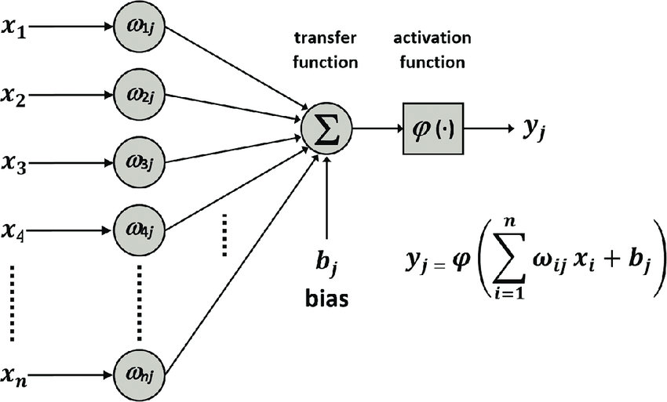
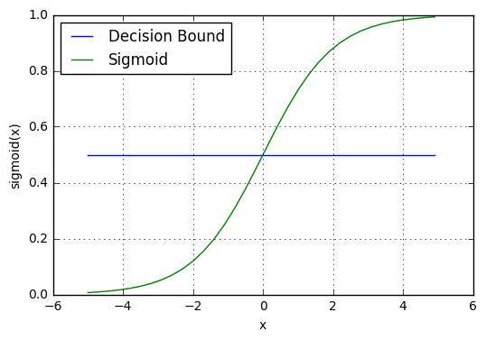
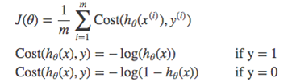
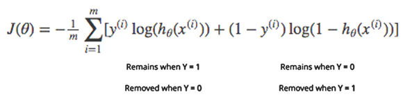
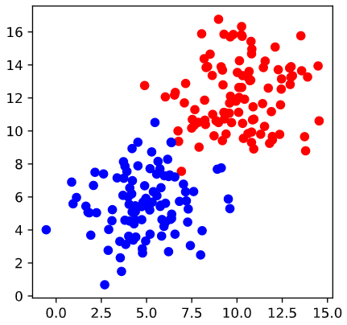
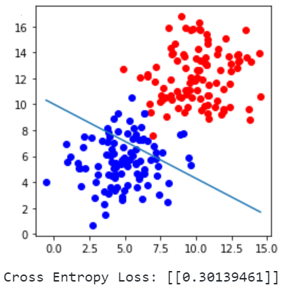
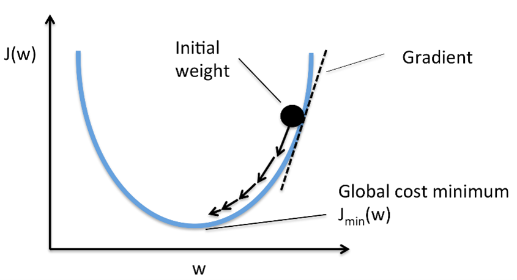
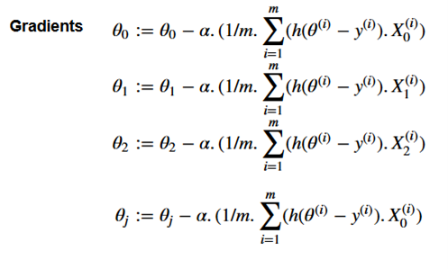
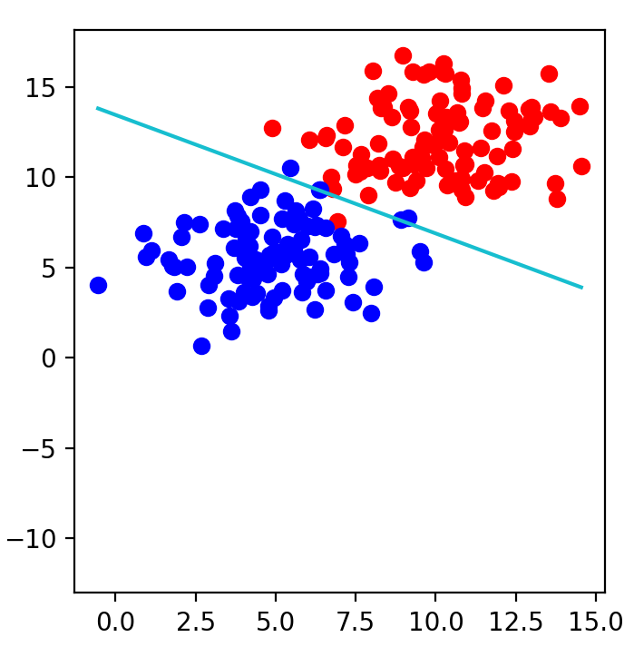

<h2>Developing a linear model that fits the data with minimal error using stochastic gradient descent</h2>
___

**Perceptron**

A Perceptron is an algorithm used for supervised learning of binary classifiers.Binary classifiers decide whether an input, usually represented by a series of vectors, belongs to a specific class.
In short, a perceptron is a single-layer neural network. It consists of four main parts:

1. Input values
2. Weights and bias
3. Net sum
4. Activation function.


**Schematic of a perceptron**




**Working of perceptron:**

The process begins by taking all the input values and multiplying them by their weights. Then, all of these multiplied values are added together to create the weighted sum. The weighted sum is then applied to the activation function, producing the perceptron's output. 

The activation function plays the integral role of ensuring the output is mapped between required values such as (0,1) or (-1,1). The weight of an input is indicative of the strength of a node. The main objective of bias is thereby to change or move each point to a particular position for a quantified area or distance. Bias permits model training and quality learning in a fast way.

**Activation function: Sigmoid**

It is a non-linear activation function.Usually used in output layer of a binary classification, where result is either 0 or 1, as value for sigmoid function lies between 0 and 1 only so, result can be predicted easily to be 1 if value is greater than 0.5 and 0 otherwise.
In order to map predicted values to probabilities, we use the binary sigmoid activation function.

Mathematically and Graphically represented as:


> * _Φ_(z) = output between 0 and 1 (probability estimate)
> * z = input to the function
> * e = base of natural log 
> ____

**Decision boundary** 

Our current prediction function returns a probability score between 0 and 1. To map this to a discrete class (true/false) we select a threshold value or tipping point above which we will classify values into class 1 and below which we classify values into class 0.
$p≥0.5,class=1$
$p<0.5,class=0$
For example, if our threshold was 0.5 and our prediction function returned 0.7, we would classify this observation as positive. If our prediction was 0.2 we would classify the observation as negative. 



**Cross-Entropy Loss: Probabilistic Interpretation**

Cost Function quantifies the error between predicted values and expected values and presents it in the form of a single real number.
We use a cost function called Cross-Entropy, also known as Log Loss which measures the performance of a classification model whose output is a probability value between 0 and 1. 

Cross-entropy loss increases as the predicted probability diverges from the actual label. Predicting a probability of .016 when the actual observation label is 1 would be bad and result in a high loss value. A perfect model would have a log loss of 0.
 Cross-entropy loss can be divided into two separate cost functions: one for y=1 and one for y=0.



The benefits of taking the logarithm reveal themselves when you look at the cost function graphs for y=1 and y=0. These smooth monotonic functions (always increasing or always decreasing) make it easy to calculate the gradient and minimize cost. 



    Data represented with a scatter plot:



``` 
def sigmoid(score):
   return 1/(1+ np.exp(-score)) 


def calc_error(line_parameter, points, y ):
   m= points.shape[0]
   p = sigmoid(points * line_parameter)
   cross_entropy = -(1/m)*(np.log(p).T * y + np.log(1-p).T * (1-y))
   return cross_entropy
```
```
n_pts = 100
np.random.seed(0)
bias = np.ones(n_pts)
top_reg = np.array([np.random.normal(10, 2, n_pts),np.random.normal(12, 2, n_pts),bias]).T
bottom_reg = np.array([np.random.normal(5, 2, n_pts),np.random.normal(6, 2, n_pts),bias]).T
all_points = np.vstack((top_reg,bottom_reg))
w1 = -0.2
w2 = -0.35
b = 3.5
line_parameter = np.matrix([w1,w2,b]).T
x1= np.array([bottom_reg[:, 0].min(), top_reg[:, 0].max()])
x2 = -b/w2  + x1 * (-w1/w2)
linear_combination = all_points*line_parameter
probabilities = sigmoid(linear_combination)
print("probabilities",probabilities) #gives probability of each point being in positive region
y= np.array([np.zeros(n_pts),np.ones(n_pts)]).reshape(n_pts*2, 1)

print('Cross Entropy Loss:',(calc_error(line_parameter,all_points,y)))
_,axis = plt.subplots(figsize=(4, 4))
axis.scatter(top_reg[:, 0], top_reg[:, 1], color = 'r')
axis.scatter(bottom_reg[:, 0], bottom_reg[:, 1], color = 'b')
draw(x1,x2)
plt.show()
```


perceptron failed to find a good decision boundary for the weight and bias values indicated by a high cross entropy loss.


**Gradient Descent:**

Gradient descent is an iterative optimization algorithm for finding the local minimum of a function
It is an optimization algorithm used to minimize some function by iteratively moving in the direction of steepest descent.
To minimize our cost, we use Gradient Descent which updates the parameters of our model coefficients in Linear regression and weights in neural network.

The principle behind gradient descent can be described as “climbing down a hill” until a local or global minimum is reached. At each step, we take a step into the opposite direction of the gradient, and the step size is determined by the value of the learning rate as well as the slope of the gradient.






If learning rate alpha is small gradient descent will be small.
If alpha is too large, gradient descent can overshoot the minimum.
The optimization may converge to different points with different starting points and learning rate.

```
def gradient_descent(line_parameter, points ,y, alpha):
   m = points.shape[0]
   for i in range(5000):
      p = sigmoid(points * line_parameter) #sigmoid_activation
      gradient = (points.T * (p-y)) * (alpha/m)
      line_parameter = line_parameter - gradient
      w1= line_parameter.item(0)
      w2= line_parameter.item(1)
      b= line_parameter.item(2)
      x1= np.array([bottom_reg[0:, 0].min(), top_reg[0:, 0].max()])
      x2 = -b/w2  + x1 * (-w1/w2)
      draw(x1,x2)
      print('iteration:',i,'loss:',calc_error(line_parameter,all_points,y),"w1:",w1,"w2:",w2,"bias:",b)
```


___


Iteration|loss|w1|w2|bias
---------|----|---|---|---
1|0.70217988|-0.0785|-0.0983|0.0
5000|0.09182152|-0.4667|-0.7101|9.5602

Above are the updated parameters: weights and bias and cross entropy loss over 5000 iterations of the gradient descent with a learning rate(alpha) set to 0.06.

Thus learning from previously labelled data to develop a linear model that fits the data with minimal error using Schostic gradient adescent algorithm.

